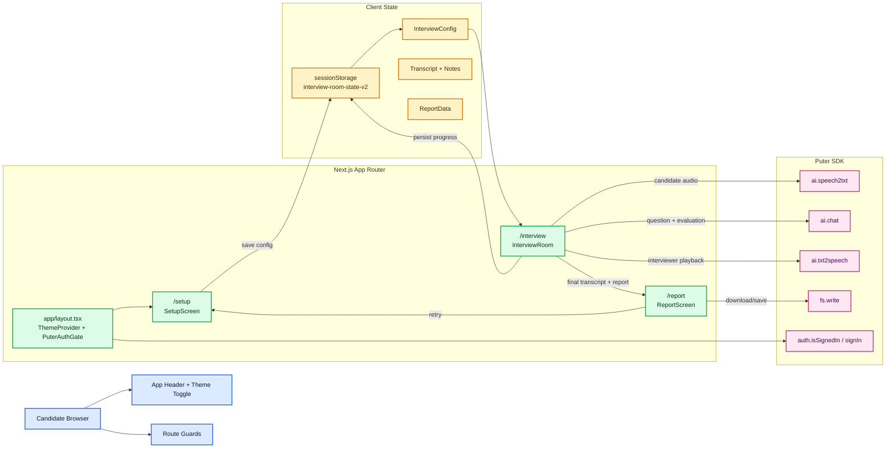
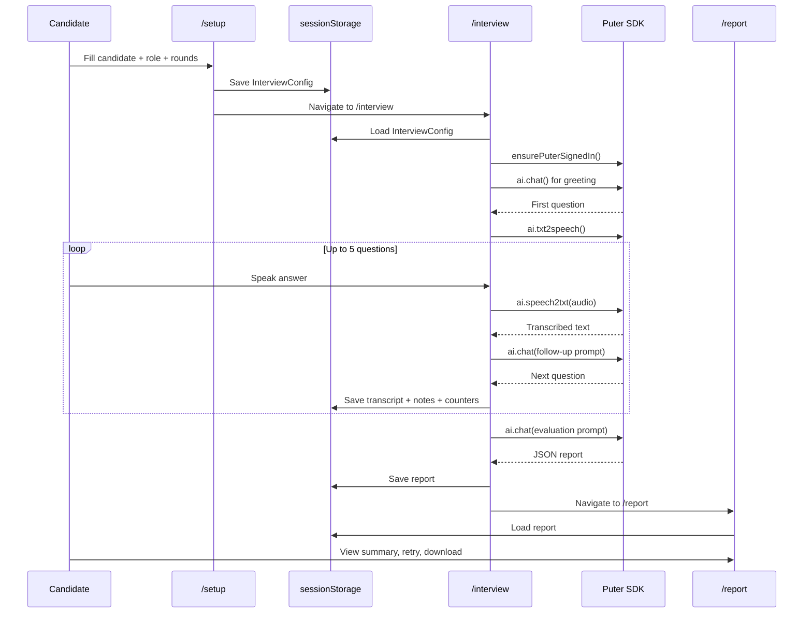

# Interview Room

Interview Room is a Next.js interview simulator with:

- Setup -> Interview -> Report route flow
- Voice-first interview experience (Puter chat, speech-to-text, text-to-speech)
- Session persistence in browser storage
- Integrity monitoring (tab switch and paste counters)
- Dark and light theme support

## Table Of Contents

- Overview
- Architecture Diagram
- Sequence Diagram
- Route Flow
- Project Structure
- Tech Stack
- Local Setup
- Scripts
- Troubleshooting

## Overview

The app uses a route-based workflow:

1. Candidate config is created in `/setup`
2. Interview runs in `/interview`
3. Final report is shown in `/report`

Session state is stored in `sessionStorage` via `lib/interview-session.ts`, so each route can resume safely.

## Architecture Diagram



## Sequence Diagram



## Route Flow

- `/` landing page and entry navigation
- `/setup` collects interview configuration
- `/interview` runs live interview logic and integrity policy
- `/report` shows final score, strengths, weaknesses, and plan

Guards:

- `/interview` redirects to `/setup` if config is missing
- `/report` redirects to `/setup` if report is missing

## Project Structure

```text
app/
   layout.tsx
   page.tsx
   setup/page.tsx
   interview/page.tsx
   report/page.tsx
components/
   SetupScreen.tsx
   InterviewRoom.tsx
   ReportScreen.tsx
   app-header.tsx
   mode-toggle.tsx
   puter-auth-gate.tsx
   theme-provider.tsx
   ui/*
lib/
   puter.ts
   interview-session.ts
types/
   index.ts
   puter.d.ts
```

## Tech Stack

- Next.js 15 (App Router)
- React 19 + TypeScript
- Tailwind CSS 4
- next-themes
- motion
- Puter SDK (chat, speech, auth, file write)

## Local Setup

Prerequisites:

- Node.js 20+

Install and run:

```bash
npm install
npm run dev
```

Default local URL:

- `http://localhost:3001`

Optional local environment file:

- Create `.env.local` if your local setup needs extra runtime values.

## Scripts

- `npm run dev` start dev server on port 3001
- `npm run build` create production build
- `npm run start` start production server
- `npm run lint` run ESLint

## Troubleshooting

- Mic or camera not working:
   - Confirm browser permissions for camera and microphone.
   - Make sure no other app is locking the device.

- Interview route redirects back to setup:
   - Session config is missing or cleared.
   - Recreate interview from `/setup`.

- Report route redirects back to setup:
   - Report data was not generated yet.
   - Complete interview flow again.

- Port conflict:
   - Stop other processes on `3001`.
   - Restart with `npm run dev`.
